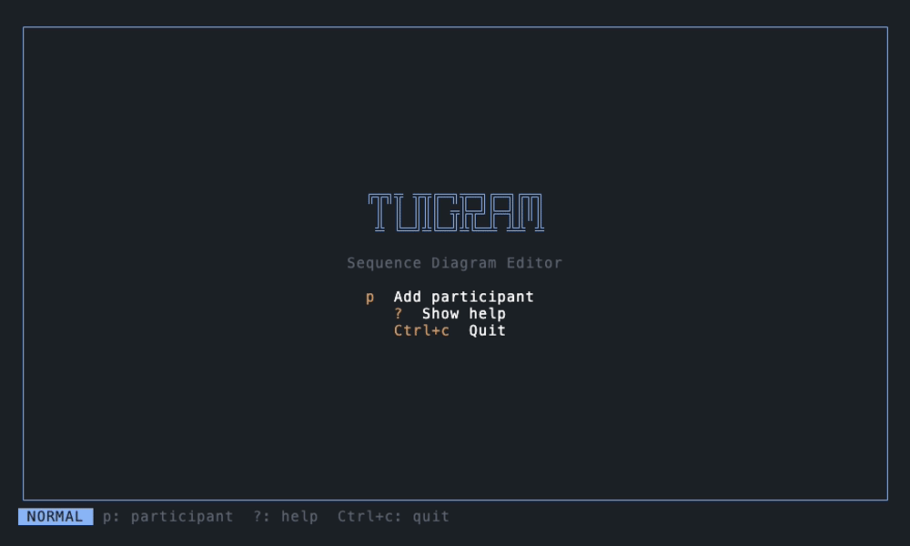

<h1 align="center">Tuigram</h1>

<p align="center">
  <a href="https://crates.io/crates/tuigram"></a>
  
  <a href="https://github.com/preiter93/tuigram/actions/workflows/ci.yml"></a>
  <a href="https://deps.rs/repo/github/preiter93/tuigram"></a>
  <a href="./LICENSE"></a>
</p>

<p align="center">
  
</p>

<p align="center"><em>A TUI sequence diagram editor.</em></p>

## Installation

<details>
<summary><b>Homebrew</b></summary>

```
brew install preiter93/tuigram/tuigram
```
</details>

<details>
<summary><b>Cargo</b></summary>

```
cargo install tuigram
```
</details>

<details>
<summary><b>Nix</b></summary>

```
nix run github:preiter93/tuigram
```
</details>

<details>
<summary><b>Pre-built binaries</b></summary>

Download from [GitHub Releases](https://github.com/preiter93/tuigram/releases)
</details>

## Keybindings

| Key | Action |
|-----|--------|
| `p` | Add participant |
| `m/M` | Insert message after/before selected |
| `n/N` | Insert note after/before selected |
| `h/l` or `←/→` | Navigate left/right (participants) |
| `j/k` or `↓/↑` | Navigate down/up (events) |
| `H/L` | Move participant left/right, reverse event arrow |
| `J/K` | Move event up/down |
| `Enter` | Edit selected |
| `r` | Rename selected |
| `d` | Delete selected |
| `E` | Export to Mermaid |
| `C` | Clear diagram |
| `?` | Help |
| `Ctrl+c` | Quit |

## Mermaid

### Export

Press `M` to export the diagram to `diagram.mmd`.

### Import

```
tuigram --import diagram.mmd
```
